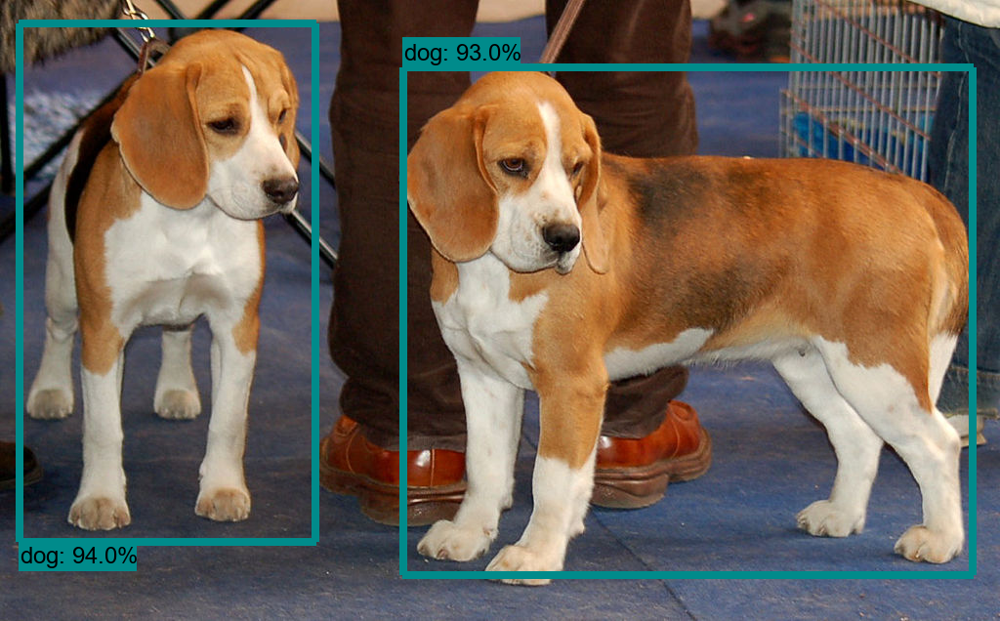
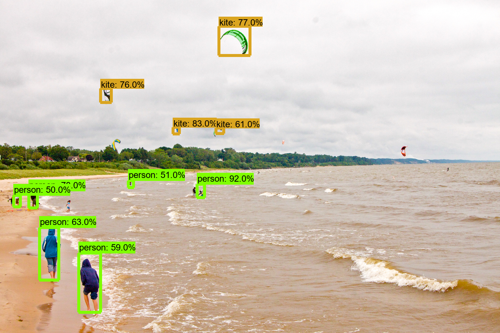

# Object Detection with TensorFlow 2.3 API on Windows10
**Last Update: 30.11.2020**

In this tutorial you will learn how to get [Object Detection with TensorFlow](https://github.com/tensorflow/models/tree/master/research) running on Windows 10. We can use the API to detect objects on Images, Videos or a Webcam.

# Quick start and usage
Clone this repository and run `setup.cmd` from your Anaconda Prompt. Make sure all the prerequisites are met.

Afterwards you can detect objects with your webcam: `python webcam.py`

# Setup on Local Machine

### Prerequisites
As a prerequisite you have to install the following:
 - Protocol Buffers
 - Windows C++ Build Tools

#### Protocol Buffers for serialization in TensorFlow
- Download the correct Protocol Buffers for your system from [here](https://github.com/protocolbuffers/protobuf/releases) and unzip the folder to `"C:\Program Files"`. I am using "protoc-3.14.0-win64".

- Add `C:\Program Files\protoc-3.14.0-win64\bin` to your 'PATH' environment variable in order to use the `protoc` command in your shell. Alternatively you can substitute the `protoc` command in the following sections with the full path of protoc.exe which should be `"C:\Program Files\protoc-3.14.0-win64\bin\protoc.exe"`

#### Windows C++ Build Tools
I had to update my C++ Build Tools in order to get pycocotools running correctly. you can download and install the newest version from [Microsoft](https://go.microsoft.com/fwlink/?LinkId=691126).

### Set up the virtual environment
I am using [miniconda](https://docs.conda.io/en/latest/miniconda.html), a light weight version of Anaconda. All commands are run on Anaconda Prompt. Alternatively you can download and execute the `setup.cmd` from this repository.

Create a virtual environment and install the necessary packages:
```bash
conda create -n tf2.3 -y python=3.8
conda activate tf2.3
pip install tensorflow==2.3.0 tf_slim opencv-python pycocotools jupyter pywin32==225
python -c "import tensorflow as tf; print(tf.__version__)"
```

### Set up the Object Detection API
Clone the Object Detection repository and install the package:
```bash
git clone --depth 1 https://github.com/tensorflow/models
cd models/research
protoc object_detection/protos/*.proto --python_out=.
pip install .
```

# Examplary Object Detection
This part is mainly based on the `object_detection_tutorial.ipynb` notebook from the `tensorflow/models/object_detection/colab_tutorials/` folder. The notebook includes only what is necessary to run in Google Colab though and repeats some of the steps we've already done in the **Setup on Local Machine** section. Besides, it's not 100% up-to-date.

```python
import cv2
import numpy as np
import os
import six.moves.urllib as urllib
import sys
import tarfile
import tensorflow as tf
import zipfile

from collections import defaultdict
from io import StringIO
from matplotlib import pyplot as plt
from pathlib import Path
from PIL import Image
from IPython.display import display

from object_detection.utils import ops as utils_ops
from object_detection.utils import label_map_util
from object_detection.utils import visualization_utils as vis_util
```

Patches:

```python
# patch tf1 into `utils.ops`
utils_ops.tf = tf.compat.v1

# Patch the location of gfile
tf.gfile = tf.io.gfile
```

## Model preparation

### Variables

Any model exported using the `export_inference_graph.py` tool can be loaded here simply by changing the path.

By default we use an "SSD with Mobilenet" model here. See the [detection model zoo](https://github.com/tensorflow/models/blob/master/research/object_detection/g3doc/detection_model_zoo.md) for a list of other models that can be run out-of-the-box with varying speeds and accuracies.

### Loader


```python
def load_model(model_name):
    base_url = 'http://download.tensorflow.org/models/object_detection/'
    model_file = model_name + '.tar.gz'
    model_dir = tf.keras.utils.get_file(
        fname=model_name, 
        origin=base_url + model_file,
        untar=True)

    model_dir = Path(model_dir)/"saved_model"

    model = tf.saved_model.load(str(model_dir))

    return model
```

### Loading label map
Label maps map indices to category names, so that when our convolution network predicts `5`, we know that this corresponds to `airplane`.  Here we use internal utility functions, but anything that returns a dictionary mapping integers to appropriate string labels would be fine


```python
# List of the strings that is used to add correct label for each box.
PATH_TO_LABELS = 'models/research/object_detection/data/mscoco_label_map.pbtxt'
category_index = label_map_util.create_category_index_from_labelmap(PATH_TO_LABELS, use_display_name=True)
```

For the sake of simplicity we will test on 2 images:


```python
# If you want to test the code with your images, just add path to the images to the TEST_IMAGE_PATHS.
PATH_TO_TEST_IMAGES_DIR = Path('models/research/object_detection/test_images')
TEST_IMAGE_PATHS = sorted(list(PATH_TO_TEST_IMAGES_DIR.glob("*.jpg")))
TEST_IMAGE_PATHS
```


    [WindowsPath('models/research/object_detection/test_images/image1.jpg'),
     WindowsPath('models/research/object_detection/test_images/image2.jpg')]


## Detection preparation

Load an object detection model:


```python
model_name = 'ssd_mobilenet_v1_coco_2017_11_17'
detection_model = load_model(model_name)
```

    INFO:tensorflow:Saver not created because there are no variables in the graph to restore
    

Check the model's input signature, it expects a batch of 3-color images of type uint8:


```python
print(detection_model.signatures['serving_default'].inputs)
```

    [<tf.Tensor 'image_tensor:0' shape=(None, None, None, 3) dtype=uint8>]
    

Add a wrapper function to call the model, and cleanup the outputs:


```python
def run_inference_for_single_image(model, image):
    image = np.asarray(image)
    # The input needs to be a tensor, convert it using `tf.convert_to_tensor`.
    input_tensor = tf.convert_to_tensor(image)
    # The model expects a batch of images, so add an axis with `tf.newaxis`.
    input_tensor = input_tensor[tf.newaxis,...]

    # Run inference
    model_fn = model.signatures['serving_default']
    output_dict = model_fn(input_tensor)

    # All outputs are batches tensors.
    # Convert to numpy arrays, and take index [0] to remove the batch dimension.
    # We're only interested in the first num_detections.
    num_detections = int(output_dict.pop('num_detections'))
    output_dict = {key:value[0, :num_detections].numpy() for key,value in output_dict.items()}
    output_dict['num_detections'] = num_detections

    # detection_classes should be ints.
    output_dict['detection_classes'] = output_dict['detection_classes'].astype(np.int64)

    # Handle models with masks:
    if 'detection_masks' in output_dict:
        # Reframe the the bbox mask to the image size.
        detection_masks_reframed = utils_ops.reframe_box_masks_to_image_masks(
            output_dict['detection_masks'],
            output_dict['detection_boxes'],
            image.shape[0], image.shape[1])
        
        detection_masks_reframed = tf.cast(detection_masks_reframed > 0.5, tf.uint8)
        output_dict['detection_masks_reframed'] = detection_masks_reframed.numpy()

    return output_dict
```

## Detection on Images


```python
def show_inference(model, image_path):
    # the array based representation of the image will be used later in order to prepare the
    # result image with boxes and labels on it.
    image_np = np.array(Image.open(image_path))
    # Actual detection.
    output_dict = run_inference_for_single_image(model, image_np)
    # Visualization of the results of a detection.
    vis_util.visualize_boxes_and_labels_on_image_array(
      image_np,
      output_dict['detection_boxes'],
      output_dict['detection_classes'],
      output_dict['detection_scores'],
      category_index,
      instance_masks=output_dict.get('detection_masks_reframed', None),
      use_normalized_coordinates=True,
      line_thickness=8)

    display(Image.fromarray(image_np))
```


```python
for image_path in TEST_IMAGE_PATHS:
    show_inference(detection_model, image_path)
```


    

    


    

    


## Detection on Webcam feed
Because the images now come from the webcam feed, they are already represented as array. Thus, we have to skip the conversion step in the show_inference function:


```python
def show_inference_webcam(model, image_np):
    # the array based representation of the image will be used later in order to prepare the
    # result image with boxes and labels on it.
    #image_np = np.array(Image.open(image_path))
    # Actual detection.
    output_dict = run_inference_for_single_image(model, image_np)
    # Visualization of the results of a detection.
    final_img = vis_util.visualize_boxes_and_labels_on_image_array(
                  image_np,
                  output_dict['detection_boxes'],      
                  output_dict['detection_classes'],
                  output_dict['detection_scores'],
                  category_index,
                  instance_masks=output_dict.get('detection_masks_reframed', None),
                  use_normalized_coordinates=True,
                  line_thickness=2)

    return final_img
```

The following function will start the webcam detection. To quit the window press 'q'.


```python
# Start Camera Inference
cap = cv2.VideoCapture(0)

while True:
    _, img = cap.read()
    # cv2.imshow('Webcam', img)

    rgb_img = cv2.cvtColor(img, cv2.COLOR_BGR2RGB)    
    detected_img = show_inference_webcam(detection_model, rgb_img)
    final_img = cv2.cvtColor(detected_img, cv2.COLOR_RGB2BGR)  
    cv2.imshow('Detector', final_img)  

    if cv2.waitKey(1) == ord('q'):
        break

cap.release()
cv2.destroyAllWindows()
```
